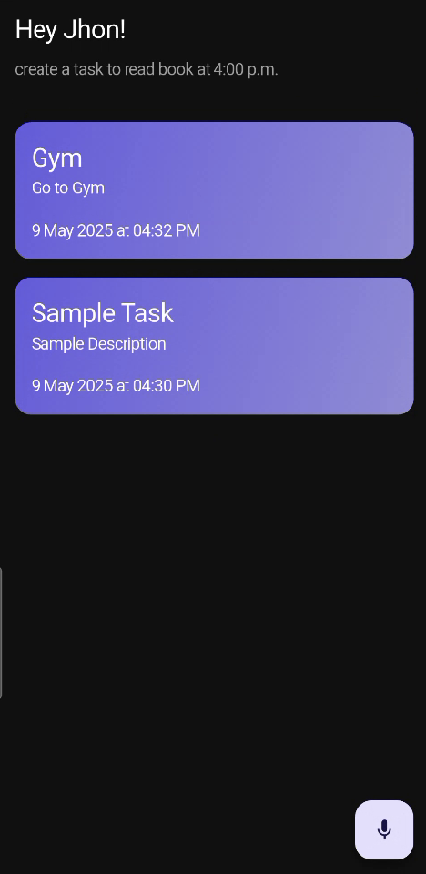

# 📝 Task Scheduling App

A Flutter app that enables users to manage their daily tasks using intuitive voice commands, integrated with Google Gemini AI. Built with Clean Architecture and BLoC state management, the app ensures maintainability, scalability, and responsiveness.

## ✨ Features

- 🎙️ Voice-Controlled Task Management
  Add, update, or delete tasks simply by speaking.
- 🧠 Google Gemini AI Integration
  Smart LLM processing to interpret commands and extract task details like title, description, date, and time.
- 📅 Smart Date & Time Recognition
  Automatically understands natural language inputs like "next Friday at 5 PM" and converts them into proper date-time objects.
- 🗂️ BLoC State Management
  Efficient and reactive UI updates using the BLoC pattern.
- 🗃️ Task Display & Management 
  Tasks are shown as scrollable cards. 
  Each card displays title, description, and scheduled date & time.
  Tasks are sorted chronologically.
  Delete tasks via voice command or UI.

🧭 App Structure & UI
Tasks are displayed in a vertical scrollable list.

Each task appears in a Card showing:

🏷️ Title

📝 Description

⏰ Scheduled Date & Time

🗑️ Tasks can be deleted using:

Voice command

UI delete icon on each card

📍FAB (Floating Action Button) is placed at the bottom right to activate voice recording.

🗣️ Voice Command Flow
Tap FAB ➡️ Starts voice recording

Speech to Text ➡️ Converts spoken words to text

LLM Parsing (Gemini) ➡️ Determines user intent and extracts task details

Task Handling ➡️ Based on command:

Create a new task

Update existing task

Delete a task

## 📸 Screenshots

### Home Screen

### Create Task

